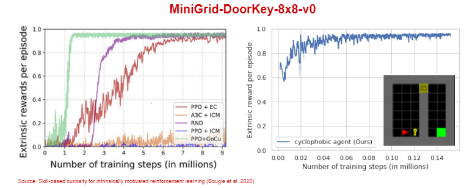

# Cyclophobic Reinforcement Learning

## Abstract

One of the trademarks of reinforcement learning is that the agent is in an experimental setting. The agent is able to perform a certain set of actions in the envrionment given specific states and observe the outcome of the chosen action. Deep learning has contributed to the ability to solve complex problems in the reinforcement learning domain thanks to the high functional capacity of neural networks. However, generalization proves difficult as the fitted models are too fragile when the task becomes more complex or the environments are changed causing distributional shift of the inputs. A rather natural approach to generalization is to learn representation of objects that represent core knwoledge about the task in the environment.  I propose that learning reusable objects is possible by systematically exploring i.e. experimenting in the environment with an appropriate inductive bias. For this, we take a brief look at category theory to reason about how  abstract objects can be described from a functional perspective.  This leads to defining an appropriate inductive bias based on cycles that characterizes a specific object by exploiting the fact that different projections of a same view reveal different structural properties depending on whether the view contains an object or not. The cycle value as inductive bias captures this structural property and yields an action vector with an optimal action for views where objects are present.  The smallest projected view is then used as a key to identify objects in different configurations of the environment. The agent is tested on a series of MiniGrid Door-Key environments where it must open doors with a key and pickup certain objects. A reward is only provided when finding the goal. Overall, We perform on par with state of the art using a simpler tabular agent while requiring substantially less steps.

## Results
The cyclophobic agent is tested on 3 different environments. 

  

  

  

### Structure of state-space for object and non-object views

- Given a successful trajectory that can be extracted from a smaller environment.
- For views that contain an object we have that the mappings $f\$ and $g\$ are injective i.e. one-to-one.
- For views that don't contain an object the mappings $f\$ and $g\$ are surjective.  
- In some cases themappings may also be surjective for views with objects, however the number of elements in $A\$ and $B\$ is considerablys maller than in the non-object case.
