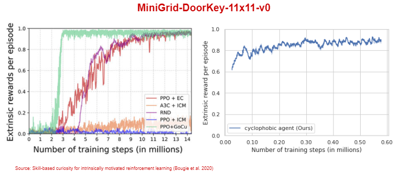
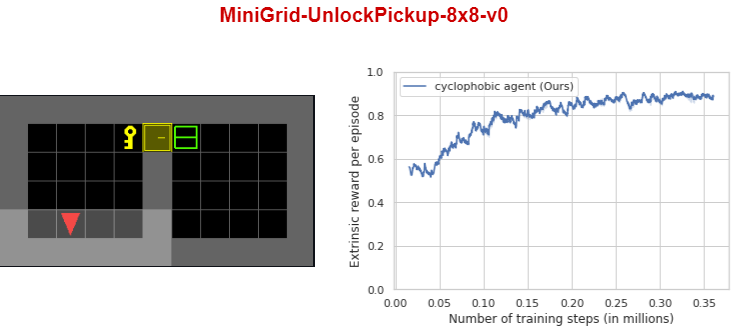
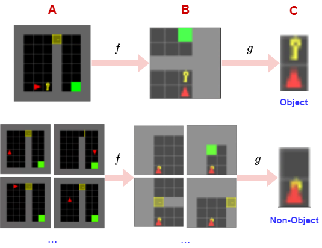
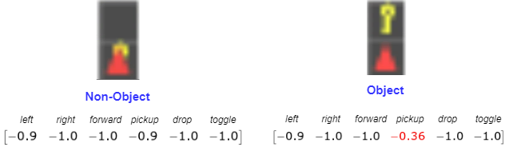

# Cyclophobic Reinforcement Learning

## Abstract

One of the trademarks of reinforcement learning is that the agent is in an experimental setting. The agent is able to perform a certain set of actions in the envrionment given specific states and observe the outcome of the chosen action. Deep learning has contributed to the ability to solve complex problems in the reinforcement learning domain thanks to the high functional capacity of neural networks. However, generalization proves difficult as the fitted models are too fragile when the task becomes more complex or the environments are changed causing distributional shift of the inputs. A rather natural approach to generalization is to learn representation of objects that represent core knwoledge about the task in the environment.  I propose that learning reusable objects is possible by systematically exploring i.e. experimenting in the environment with an appropriate inductive bias. For this, we take a brief look at category theory to reason about how  abstract objects can be described from a functional perspective.  This leads to defining an appropriate inductive bias based on cycles that characterizes a specific object by exploiting the fact that different projections of a same view reveal different structural properties depending on whether the view contains an object or not. The cycle value as inductive bias captures this structural property and yields an action vector with an optimal action for views where objects are present.  The smallest projected view is then used as a key to identify objects in different configurations of the environment. The agent is tested on a series of MiniGrid Door-Key environments where it must open doors with a key and pickup certain objects. A reward is only provided when finding the goal. Overall, We perform on par with state of the art using a simpler tabular agent while requiring substantially less steps.

* * *

## Results
#### The cyclophobic agent is tested on 3 different environments:
<dl>
<dt>MiniGrid-DoorKey-8x8-v0 and MiniGrid-DoorKey-11x11-v0 </dt>
<dd>In this environment the agent has to pickup a key to open a door. After every episode the position of key, door and wall are change randomly. This is a sparse reward environment meaning that the agent only gets a reward when reaching the green goal state. Thus, the agent has to solve the environment without any extrinsical reward as feedback about its actions.</dd>
<dt>MiniGrid-UnlockPickup-8x8-v0</dt>
<dd>This environment is an extension of the DoorKey environment. Not only has the agent to pickup a key and open a door, but then drop the key and pickup the box to complete the environment and get a reward. This is especially difficult because the agent needs to understand the fact the key must be dropped after opening the door. Furthermore, the box can be destroyed if the agent uses the 'toggle' instead of the 'pickup' action.</dd>
</dl>

 

  

  

  

* * *

## Motivation for Cycles as Inductive Bias
#### Exploiting structure of state-space for object and non-object views
- Given a successful trajectory or near succesful trajectory where the agent has managed to pickup the key and open the door through exploration.

  

**Use projections of full view to characterize objects:**
  - $f: A \rightarrow B$ is a projection of the full view $A$ and to the partial 5x5 view $B$. 
  - $g: B \rightarrow C$ is a projection of view $B$ to the smallest view $C$, which contains only the cell immediately in front of the agent.
  - It is used as object representation! 

**Properties of projections $f$ and $g$ change according to whether it is an object view or non-object view!**
  - For views $C$ that contain an object, we have that the projections $f\$ and $g\$ are injective i.e. one-to-one.
  - For views $C$ that don't contain an object the projections $f\$ and $g\$ are surjective.  
  - In some cases the projections may also be surjective for views with objects, however we have that $\mathbf{card}(A_{nonobj}) \gg \mathbf{card}(A_{obj})$ and  $\mathbf{card}(B_{nonobj}) \gg \mathbf{card}(B_{obj})$

**Conclusion:**
  - This is a rudimentary form of attention on objects induced by the agents behaviour in the trajectory.
  - Manipulating an object is a salient event for the agent compared to moving inempty space not linked to an object. 

* * *

## Cycles as Inductive Bias for Exploration and Object Discovery
### Background 
A Markov decision process (MDP) is desribed by a tuple $(\mathcal{S}, \mathcal{A}, \mathcal{P}, \mathcal{R}, \gamma)$
- $\mathcal{S}$ is a finite set of states
- $\mathcal{A}$ is a finite set of actions
- $\mathcal{P}$ is a state transition probability matrix
- $\mathcal{R}$ is a reward funcion, $\mathcal{R}(s,a) = \mathbb{E} \[R_{t+1} \mid S_t = s, A_t =a \]$
- $\gamma$ is a discount factor $\gamma \in \[0,1\]$

### Defining agent's update rule
#### Action-value and cycle-value functions
We then define the action-value function $Q$ under the MPD $(\mathcal{S}, \mathcal{A}, \mathcal{P}, \mathcal{R}, \gamma)$ as,
  - $$Q(s,a) = R(s,a) + \gamma \sum_{s'}P_{ss'}^{a} \sum_{a'} \pi(a' \mid s') Q(s', a') $$

Analogously, we define the cycle-value function $Q_c$, where we now replace $\mathcal{R}$ with the cyclophobic intrinsic reward function $\mathcal{R}_c$,
  - $$Q_c(s,a) = R_c(s,a) + \gamma \sum_{s'}P_{ss'}^{a} \sum_{a'} \pi(a' \mid s') Q_c(s', a')$$ 

#### Action-value and cycle-value functions for projected state space $\mathcal{S}$
.....

#### Update rule
We use tabular SARSA as update rule for the agent. 
- For the action value function $Q$:
  - $$Q(s_t, a_t) \leftarrow (1-\alpha)Q(s_t, a_t) + \alpha(r + \gamma Q\big(s_{t+1}, a_{t+1})\big)$$

- For the cycle value function $Q_c$:
  - $$Q_c(s_t, a_t) \leftarrow (1-\alpha)Q(s_t, a_t) + \alpha(r_c)$$

Note that the cyclophobic intrinsic reward is not propagated, but rather only given for the current state-action pair. Overall, we learn the action value and cycle value functions separately. First cycle value function $Q_c$ is learned. After the first successful trajectory the action value and cycle value function are added together,

  $$Q(s,a) = Q^0(s,a) + Q^{0}_{c}(s,a) $$

### Cycles as intrinsic reward
  **Defining a cycle**
  - Given a sequence of states $$\bar{s} = \{s_1, s_2, \ldots, s_l \}$$
  - A cycle is defined as encountering the same observation twice in a sequence:
    - $$s' = s_1 \lor s' = s_2 \lor \ldots \lor s' = s_l$$, where s' is the next state producing a cycle.
  - Then given state $s$, the probability that the action $a$ produces a cycle is: $p(s' \mid s, a)$
    
  **Cycle penalty**
  - Say we encounter such a transition $\tau = \\{s, a, s' \\}$ which produces a cycle: 
    - Let $r^{ex} \in \mathbb{R}$ be the extrinsic reward i.e. the regular reward the agent receives from the environment.
    - Let $r^{c} \in \mathbb{R}$ be the intrinsic reward the agent receives for encountering a cycle.
    - The full reward for the transition then is: 
      - $$r = r^{ex} - r^{c} / N_c(s_t, a_t)$$
      - where $N_c(s_t, a_t)$ is the number of cycles encountered for the state-action pair.

  **Normalizing the cycle penalty**
  - An immediate cycle encountered after one step (agent is stuck) should not be weighted equally as a larger cycle.
  - We thus weigh $r^c$ according to the cycle size:
    - Let $\tau_{t=g} = \\{s_k, a_k, s_{k+1} \\}$ and $\tau_{t=h} = \\{s_n, a_n, s_k \\}$ be two transitions that occur at timesteps $g$ and $h$. Moreover, $\tau_{t=h}$ produces a cycle as it encounters state $s_k$ from $\tau_{t=g}$.
    - Then the cycle size is: $\lambda^c = h - g$.
    - Thus the normalized intrinsic reward $r^c$ is extended as follows: $r^c = r^c / \lambda^c$.
  - The final full reward for the transition then is: $r = r^{ex} - (r^c / \lambda^c) / N_c(s_t, a_t)$.

### Cycle penalty as inductive bias for object discovery

  

- Every entry in the action vector now describes how likely a cycle is to occurr if action $a$ is taken.
- For a view that contains an object, the cycle value identifies a specific action that causes less cycles than the other actions.  
- For a view that contains a non-object the cycle values are non-specific.
- From a statistical learning point of view: Non-object view is more confounded than object view.

* * *
## Learning pipeline for cyclophobic agent
......
